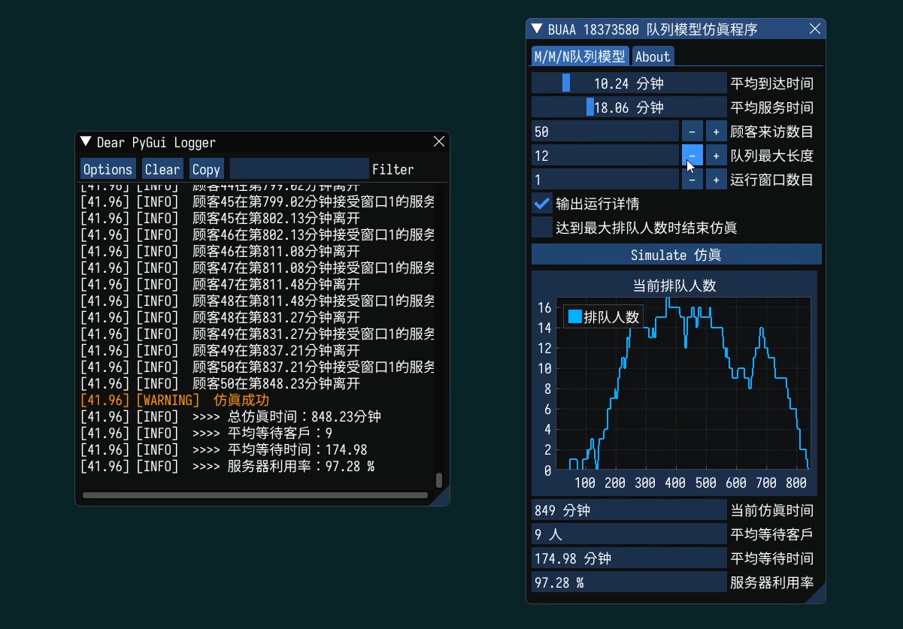

## 一、    实验目的

应用M/M/1队列编程思想，模拟北航新北学五食堂的排队过程，熟悉离散事件推进方式、队列建立和提取方式。

## 二、    数学模型

### 1.   确定模型框架

​    基于事件调度法，采用下一事件推进方法实现仿真时间的推进，创建一根事件轴和一支队列。先判定事件轴是否忙碌，是就根据时间先后顺序让顾客进入队列，否则推进事件，此过程会跳过没有事件的阶段，节省了计算机运行时间。

### 2.   扩充细节

在本次仿真中，顾客到达间隔时间、窗口服务时间按指数分布生成：泊松分布是一种用来描述一定的空间或稀有事件发生次数的概率分布，而指数分布可以由泊松分布推导出，是可以用来描述随机事件发生时间间隔的概率分布，对应的概率密度函数为：

因此用指数分布对顾客到达间隔时间、窗口服务时间进行建模。

通过下一事件推进方法实现仿真时间的推进，本次仿真中，事件推进的关键节点种类主要有到达、服务、结束三种，将在代码实现部分具体阐述。

### 3.   简述事件调度法、活动扫描法和进程交互法的异同。

#### 相同点

事件调度法、活动扫描法和进程交互法都是基于时间对事件的发生进行建模的，需要维护一个时间变量标记事件发生的时间。

它们的核心都是时间按照时间顺序发生，按仿真时钟推进。

#### 不同点

- 事件调度法：关注事件以及它们如何影响系统状态。

- 活动扫描法：关注活动（每一活动对应开始时间和结束时间）；既使用调度时间，也使用条件来选择事件列表的下一事件。

- 进程交互法：关注实体以及它所经历的事件/活动序列。

## 三、    编程实现与调试过程

### 1.   分析一下到达和离开的事件处理流程

采用事件调度法，将事件分为三类：

- 到达（顾客到达）

- 服务（顾客开始接受服务）

- 离开（顾客服务结束）

事件序列包含了这三种事件，使用Python中的优先队列结构（PriorityQueue）实现，以事件发生时间、顾客到达时间为主次优先级，越小的优先级越高，先处理优先级高的事件。当事件序列为空时，说明仿真结束。

#### 事件处理流程：

1.  初始化到达事件序列：根据平均到达时间，使用Python的numpy库中的exponential()指数分布函数，生成随机的用户到达间隔时间，将这些未来事件放入事件序列。

2. 当事件序列不为空时，重复如下流程：

   a)    从事件序列的队首（优先级最高）弹出一个事件，并处理， 先判断该事件的类型。

   b)   如果这是一个到达事件，判断当前是否存在空闲窗口，如果存在则在当前仿真时钟将一个服务事件推入事件序列中；如果不存在且等待队列达到最大长度时，结束仿真；否则将该事件加入等待队列。

   c)    如果这是一个服务事件，通过指数分布函数随机生成服务时间，将仿真时钟推进到结束服务的时刻，将一个离开事件推入事件序列中。

   d)   如果这是一个离开事件，判断当前等待队列是否为空，若不为空，则在当前仿真时钟将一个服务事件推入事件序列中。

   e)    计算事件处理过程中的等待时间、等待客户数、服务器利用率等值，输出结果（过程值在GUI中输出，结果值在日志中输出，用于最后一步的分析与优化）。

### 2.   代码实现

建立事件对象类Event，存储事件序号、对应窗口、事件类型、事件开始时间、事件结束时间，并为事件配置比较和输出方法。

当从GUI的仿真按钮确认开始仿真后，按照事件处理流程，所用到的主要函数如下：

a)   初始化，根据平均到达时间生成随机的用户到达间隔时间，将这些未来事件放入事件序列。

b)   对运行过程进行仿真，这里直接模拟了M/M/n模型，具体实现如下：

c)   仿真结束后将结果输出到日志和GUI上。图像绘制按照固定时间步长推进方法，以每分钟为间隔刷新图像。绘制了当前排队人数的折线图，同时刷新当前时间、平均等待时间、平均等待客户数、平均服务器利用率等值。

对应GUI效果图：

视频演示地址：

- 知乎：https://www.zhihu.com/zvideo/1307375212308856832

- 哔哩哔哩：https://www.bilibili.com/video/BV1cz4y1y7nW

### 3.   多次仿真结果

控制输入参数，对多次仿真的结果取均值后，得到下表（部分）：

| 编号         | 输入参数     |              |          |              | 输出参数                   |                |              |
| ------------ | ------------ | ------------ | -------- | ------------ | -------------------------- | -------------- | ------------ |
| 平均到达时间 | 平均服务时间 | 平均执行时间 | 顾客数目 | 队列最大长度 | 逗留时间                   | 平均等待客户数 | 服务器利用率 |
| 1            | 5            | 7            | 50       | 35           | 30                         | 4              | 85.23%       |
| 2            | 5            | 10           | 50       | 30           | 97                         | 9              | 92.84%       |
| 3            | 10           | 10           | 50       | 25           | 40                         | 2              | 82.49%       |
| 4            | 10           | 20           | 50       | 30           | 230                        | 12             | 97.31%       |
| 5            | 10           | 20           | 50       | 20           | 达到排队最大人数，提前结束 |                |              |
| 6            | 5            | 7            | 100      | 60           | 80                         | 20             | 95.76%       |
| 7            | 5            | 10           | 100      | 60           | 250                        | 27             | 97.84%       |
| 8            | 10           | 10           | 100      | 25           | 68                         | 5              | 90.17%       |
| 9            | 10           | 20           | 100      | 55           | 428                        | 20             | 98.47%       |
| 10           | 10           | 20           | 100      | 20           | 达到排队最大人数，提前结束 |                |              |

通过控制变量，可以得到以下推论：

- 控制平均到达时间和服务时间，当顾客数目增加时，能够维持不中断仿真的队列最大长度满足关系：

- 当平均到达时间和平均服务时间最接近时，用户的平均执行时间、队列等待数最小，用户体验最好

- 用户体验（逗留时间和队列平均长度较小时，用户可以快速完成所需请求，体验较好）越好，窗口利用率越低。其他条件不变而用户增加时，窗口的利用率也有所提高（窗口利用率影响运营人员的资源利用率，同样要以提高利用率为目标）

仿真结果与现实排队的常识较为接近，之后将运用结论给出北航新北学五食堂的排队优化策略。

### 4.   编程模拟M/M/n模型

代码已在上文给出，主要方法是增加了对窗口列表的轮询：

M/M/1是M/M/n的一个特例，主要是要解决分配窗口的问题。这里给出图形化演示，通过调整GUI中的窗口数量，可以给出M/M/n模型下的仿真结果。

增加窗口数目到2，窗口数与到达时间的乘积和服务时间最接近，此时再次进行仿真：

窗口继续增加，总仿真时间变化不大，各窗口利用率降低：

## 四、    以北航新北学五食堂为例，给出初步的窗口优化策略

### 1.   该场景的拓扑结构

- 食堂窗口：提供服务，抽象为服务器
- 学五食堂：各窗口提供菜品较为接近，所需服务时间接近，可以近似为平均服务时间；新北负一层炸鸡汉堡点餐和石锅饭点餐的巨大时间差距就不好用本例进行模拟。
- 队伍最大长度：学五食堂点餐区和就餐区之间存在隔板，队伍长度有限，存在最大队伍长度；同时各窗口前空间较为接近，可视为存在统一的队列最大长度。

### 2.   人流特点

学五食堂就餐人员以北区住宿人员为主，在工作日的下课后半小时为高峰期，顾客来访数目大为增加。

### 3.   改进措施

由前文结论，得：

1)   当平均到达时间和平均服务时间最接近时，用户的平均执行时间、队列等待数最小，用户体验最好，可以增加对食堂阿姨的培训，应用自助点餐系统，加速打饭时间。

2)   顾客数目增加时，队列最大长度也需要增加，可以通过取号的方式扩充排队空间。

3)   在第20~30分钟，等待人数达到最大值，可以在此时间段增开临时窗口。